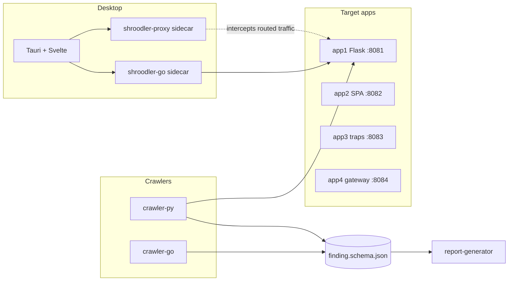

# Shroodler

Self-contained **local** web attack-surface mapping toolkit. Target apps live in this
repo and are intentionally vulnerable — do not "fix" them. The crawler must not probe
the public internet except during optional Milestone 24 (`--allow-external`).



## Quickstart

```bash
make up          # target apps on 127.0.0.1:8081–8084 (Docker Compose, or local-up if Docker is missing)
make verify      # lint + unit + integration
.venv/bin/shroodler crawl http://127.0.0.1:8081 --output out.json
.venv/bin/shroodler report out.json --format html --output out.html
.venv/bin/shroodler diff out.json packages/target-apps/app1-server-rendered/expected_findings.json

# Go crawler
make bins
packages/crawler-go/shroodler-go crawl http://127.0.0.1:8081 --output out.json

# Intercepting proxy (traffic you route through it)
packages/proxy-go/shroodler-proxy ca generate
packages/proxy-go/shroodler-proxy start --record /tmp/sess.jsonl
curl -x http://127.0.0.1:8888 http://127.0.0.1:8081/

# Desktop (Tauri)
cd packages/desktop-app && npm install && npm run tauri dev
```

`make down` stops target apps.

Coverage report: `make cover` (Python fails under 90%; Go prints internal-package percents).

External smoke (off by default, never part of `make verify`):

```bash
.venv/bin/shroodler crawl https://httpbin.org/get --allow-external --depth 0 --output /tmp/ext.json
```

See `docs/` for architecture, spec, test matrix, milestones, UI style, and proxy contract.
