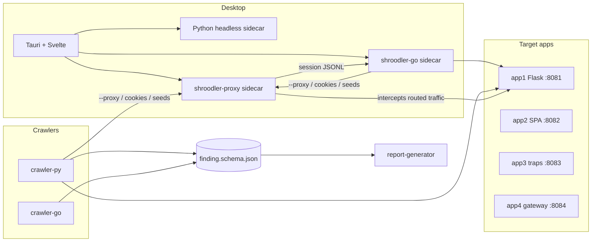

# Shroodler

Web attack-surface mapping toolkit. Target apps live in this repo and are intentionally
vulnerable — do not "fix" them. By default the crawler only probes local targets
(127.0.0.1/localhost); pass `--allow-external` to scan any remote host you're
authorized to test.



## Quickstart

```bash
make up          # target apps on 127.0.0.1:8081–8084 (Docker Compose, or local-up if Docker is missing)
make verify      # lint + unit + integration
make cli         # install the Python CLI, build Go binaries, print paths
```

## Command line

The CLI is the full product surface (the desktop app shells out to the same commands).

```bash
make bootstrap   # .venv + `shroodler` console script
make bins        # shroodler-go + shroodler-proxy

# Python CLI (also: ./scripts/shroodler …)
.venv/bin/shroodler crawl http://127.0.0.1:8081 --output out.json
.venv/bin/shroodler crawl http://127.0.0.1:8081 --login-recipe packages/target-apps/app1-server-rendered/login-recipe.json --output authed.json
.venv/bin/shroodler crawl http://127.0.0.1:8082 --mode headless --output spa.json
.venv/bin/shroodler report out.json --format html --output out.html
.venv/bin/shroodler diff out.json packages/target-apps/app1-server-rendered/expected_findings.json
.venv/bin/shroodler payload out.json -o hits.json
.venv/bin/shroodler version

# Baseline-in-git for any local app (fail CI on new findings)
.venv/bin/shroodler baseline out.json -o expected_findings.json --name my-app
.venv/bin/shroodler diff out.json expected_findings.json --gate   # plus optional .shroodlerignore
.venv/bin/shroodler report out.json --format sarif -o results.sarif
.venv/bin/shroodler report out.json --format junit -o results.xml

# Go crawler (same subcommands)
packages/crawler-go/shroodler-go crawl http://127.0.0.1:8081 --output out.json

# Intercepting proxy (traffic you route through it)
.venv/bin/shroodler proxy ca generate
.venv/bin/shroodler proxy start --record /tmp/sess.jsonl
# equivalent: packages/proxy-go/shroodler-proxy …
curl -x http://127.0.0.1:8888 http://127.0.0.1:8081/
# Crawl through the proxy, then turn captures into findings / authenticated crawl
packages/crawler-go/shroodler-go crawl http://127.0.0.1:8081 --proxy http://127.0.0.1:8888 --output out.json
packages/crawler-go/shroodler-go ingest-sessions /tmp/sess.jsonl --target http://127.0.0.1:8081 --output from-proxy.json
packages/crawler-go/shroodler-go crawl http://127.0.0.1:8081 --cookies-from /tmp/sess.jsonl --seed-from /tmp/sess.jsonl

# Optional: put shroodler, shroodler-go, shroodler-proxy on PATH
make install-cli   # symlinks into ~/.local/bin

# Desktop (Tauri)
cd packages/desktop-app && npm install && npm run tauri dev
```

`make down` stops target apps.

Coverage report: `make cover` (Python fails under 90%; Go prints internal-package percents).

External smoke (off by default, never part of `make verify`):

```bash
.venv/bin/shroodler crawl https://httpbin.org/get --allow-external --depth 0 --output /tmp/ext.json
```

See `docs/` for architecture, spec, test matrix, milestones, UI style, and proxy contract.
